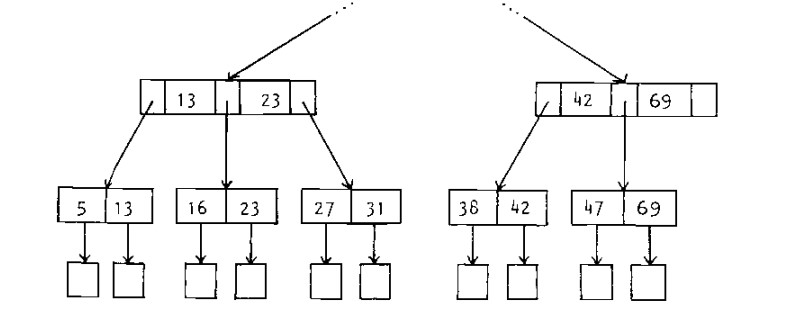

# BPTree-verif
B+ Tree data structure formal verification using [dafny](https://dafny.org/)

Project led by Ivona Martinovic & Guilhem Mathieux (@guimath) for the CS6271 (advanced topics in software engineering) class at NUS
## Data structure description 

B+ tree is a specialized variant of the B-tree data structure characterized by distinctive organization of data. Much like the conventional B-trees, B+ trees are inherently balanced, ordered and exhibit n-ary tree properties.

Main difference with B trees is that data in B+ trees is stored exclusively in leaf nodes (linked list).

We define the order $n$ of B+ tree as the maximum amount of keys an internal node can have.  

Example of a rank 2 B+ tree :

## Invariants that must be maintained

For a tree of rank n

#### For all nodes 
- min_keys : must contain at least floor(n/2) keys.
- sorted : keys are sorted from left two right

#### For internal nodes
- child_nb : contains one more child than it has keys. 
- child_height_eq : all subtrees must be the same height. 
- hierarchy : all keys in a given subtree is bounded by surrounding keys in parent node.

#### for leaves
- leaves_height_eq : all leaves are at the same distance from the root (always -1).
- linked_leaves : contains extra pointer towards the next leaf.
- all_keys_in_leaves : all keys appear in a leaf node.

## for root 

- min_root : If the root node is an internal node, it must contain at least 2 children.

All these invariants are defined as ghost predicates in the [BPTNode.dfy](BPTNode.dfy) file